# CSE 40535 — Project 03 & 04
## Face Recognition Pipeline: Preprocessing, Segmentation, Feature Extraction, and Classification

---

## Overview

This project builds a complete face recognition pipeline using two publicly available datasets: the **BioID Face Database** and **Labeled Faces in the Wild (LFW)**. The pipeline covers four stages: data preprocessing, face detection and segmentation, feature extraction, and classification. The goal is to take raw face images and transform them into structured numerical descriptors, then use those descriptors to train and evaluate two classifiers — a Support Vector Machine (SVM) and a Multi-Layer Perceptron (MLP).

---

## Datasets

- **BioID Face Database** — 1,521 grayscale images of 23 subjects captured under controlled but varied lighting and pose conditions. Downloaded from the [official BioID website](https://www.bioid.com/face-database/).
- **Labeled Faces in the Wild (LFW)** — ~13,000 color images of public figures collected from the web, organized by identity. Downloaded from [Kaggle](https://www.kaggle.com/datasets/atulanandjha/lfwpeople?resource=download). Only identities with 30 or more images are used for classification, yielding 34 identities and 2,370 images.

---

## Methods

### 1. Data Preprocessing

Every image from both datasets is passed through the same four-step preprocessing pipeline before any further processing takes place.

**Step 1 — Resize to 128×128**
Images across both datasets come in different resolutions. Resizing them all to a fixed 128×128 ensures that subsequent operations are consistent and comparable regardless of the original image dimensions.

**Step 2 — Grayscale Conversion**
Converting to grayscale reduces each image from a 3-channel representation to a single intensity channel, which simplifies computation and focuses the pipeline on structural properties of the face.

**Step 3 — Adaptive Histogram Equalization (CLAHE)**
CLAHE normalizes local contrast across the image, making it more robust to lighting differences between datasets. Unlike standard histogram equalization which operates globally, CLAHE works on small local regions, preserving important facial detail rather than blowing out highlights or crushing shadows.

**Step 4 — Gaussian Filter (Denoising)**
A small Gaussian blur (3×3 kernel, σ=1.0) is applied to reduce high-frequency noise, particularly relevant for the older BioID images which show more sensor noise.

---

### 2. Face Detection and Segmentation

After preprocessing, the pipeline isolates the face region in three steps.

**Step 1 — Haar Cascade Face Detection**
A pre-trained Haar Cascade detector (`haarcascade_frontalface_default.xml`) locates the face bounding box in the image. This replaces the earlier K-means approach, which partitioned pixel intensities globally and was unreliable on varied real-world backgrounds. If no face is detected, the pipeline falls back to a centre crop covering 75% of the image.

**Step 2 — Eye Detection and Alignment**
Within the detected face crop, a second Haar Cascade (`haarcascade_eye.xml`) locates the eyes. If two eyes are found, the image is rotated so they are level — a standard normalization step in face recognition that removes head-tilt variation. Rotations greater than 30° are treated as detection errors and skipped.

**Step 3 — K-means Background Removal**
K-means clustering (k=2) is applied within the detected face crop to separate the face from remaining background (hair, clothing edges, shadows). The cluster containing the centre pixel of the crop is treated as foreground; the other cluster is zeroed out. This ensures that extracted features are driven by face appearance rather than background content.

The masked face crop is then resized to 64×64 pixels for feature extraction.

---

### 3. Feature Extraction

Three complementary descriptors are extracted from each 64×64 face crop and concatenated into a single feature vector.

**HOG — Histogram of Oriented Gradients**
HOG describes the shape and structure of a face by computing the distribution of edge directions in small local patches. The image is divided into 8×8 pixel cells; within each cell a 9-bin histogram of gradient orientations is computed, then normalized across 2×2 blocks of cells. The result is a 1,764-dimensional vector capturing facial geometry — jawline shape, eye position, nose structure — in a way that is relatively robust to small lighting changes.

**Multi-Scale LBP — Local Binary Patterns**
LBP captures fine texture by comparing each pixel to its neighbors and building a histogram of the resulting binary codes. To capture texture at multiple scales, histograms are computed at three (radius, n_points) configurations — (1, 8), (2, 16), and (3, 24) — and concatenated into a 42-dimensional vector. This captures both fine micro-texture and coarser structural patterns.

**Colour Histogram (HSV)**
An 8-bin histogram is computed for each of the three HSV channels (hue, saturation, value) using only foreground pixels, producing a 24-dimensional colour descriptor. This captures skin tone and overall colour distribution that can differentiate individuals under consistent lighting conditions.

**Per-Descriptor L2 Normalisation**
Before concatenation, the HOG vector and the LBP vector are each independently L2-normalised. Without this step, the 1,764-dimensional HOG vector would dominate the distance metric, effectively making LBP and colour features irrelevant. The final descriptor is approximately 1,830 dimensions.

---

## Illustrations

The following pipeline figures show how each image is processed through all stages, from raw input to final feature maps. Results are shown for both datasets.

### BioID Dataset

**BioID_0000**
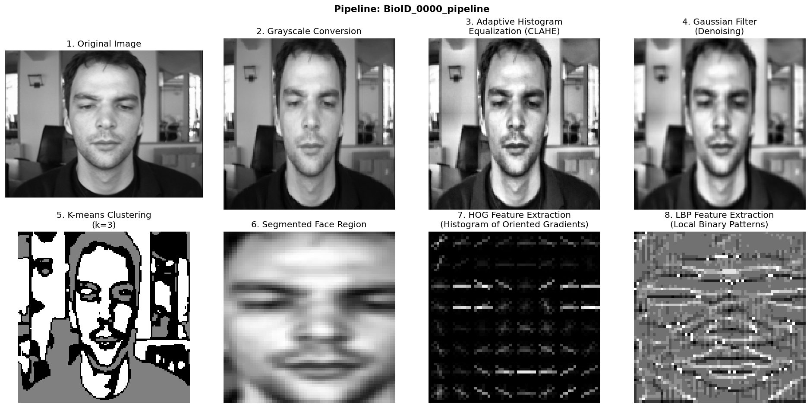

**BioID_0001**
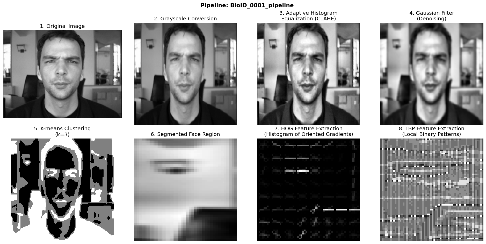

**BioID_0002**
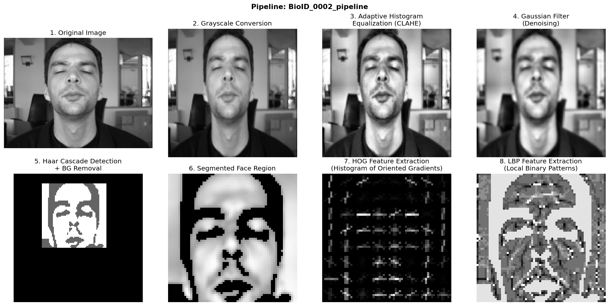

---

### LFW Dataset

**Aaron Eckhart**
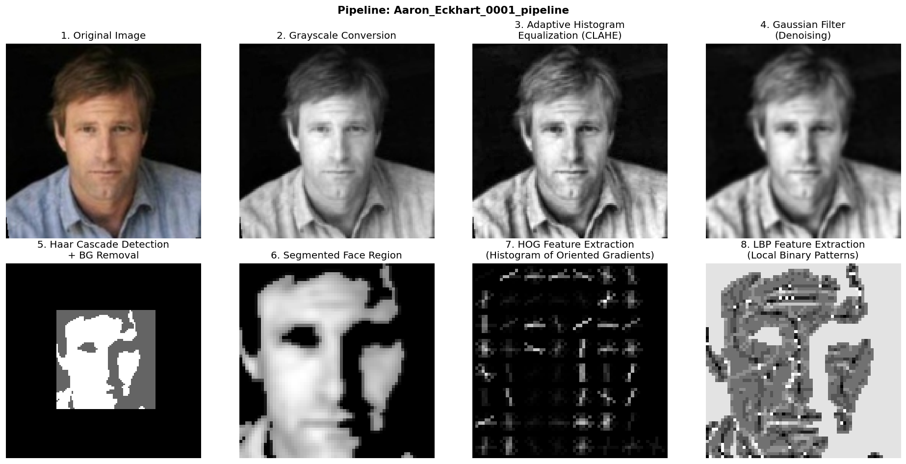

**Aaron Guiel**
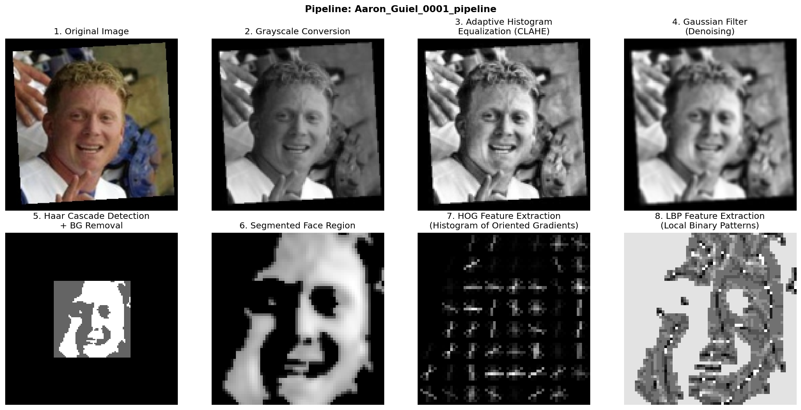

**AJ Cook**
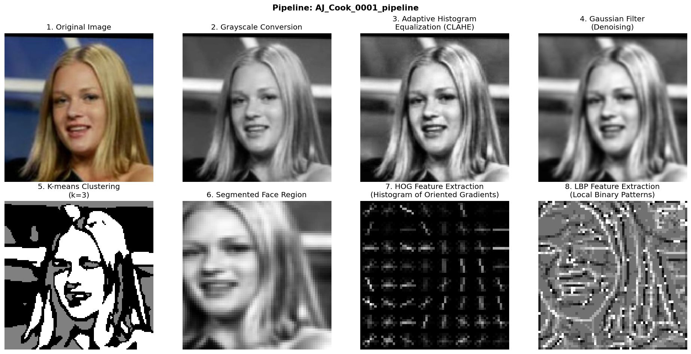

---

## Running the Code

### Setup

```bash
conda env create -f environment.yml
conda activate cv-project03
```

### Configuration

Open `run.py` and set the dataset paths at the top of the file:

```python
BIOID_DIR = "/path/to/BioID_database"
LFW_DIR   = "/path/to/lfw_funneled"
```

### Run

```bash
# Pipeline visualizations only
python run.py pipeline

# Train and evaluate classifiers
python run.py train
```

Pipeline visualizations for the first 5 images of each dataset are saved to `output/BioID/` and `output/LFW/`. Classification results, confusion matrices, and saved models are written to the same directories.

---

## Part 4 — Classification Report

### Overview

This section covers the classification stage of the pipeline. Two classifiers are trained and evaluated on the feature vectors produced by the pipeline described above: a **Support Vector Machine (SVM)** with an RBF kernel and a **Multi-Layer Perceptron (MLP)**. Both are evaluated on a stratified 70/20/10 train/validation/test split. The 10% test set is held out entirely and only evaluated in Part 5.

---

### Experimental Setup

**Feature preprocessing for classification:**
After feature extraction, the 1,830-dimensional descriptors are standardized using `StandardScaler` (zero mean, unit variance). Principal Component Analysis (PCA) is then applied, retaining enough components to explain 99% of the variance. This step is critical: with approximately 22 training samples per class and nearly 1,800 features, classifiers overfit severely without dimensionality reduction. PCA compresses correlated features and forces the model to generalize across a lower-dimensional subspace.

**Classifiers:**
- **SVM** — RBF kernel, C=50, `gamma="scale"`, `class_weight="balanced"`. The balanced class weight compensates for the significant imbalance between classes.
- **MLP** — Two hidden layers (512, 256 units), ReLU activation, early stopping on an internal 10% validation split, up to 300 epochs.

**LFW filtering:**
Only identities with at least 30 images are included in the LFW experiment, yielding 34 identities (2,370 images). This yields a more tractable problem: fewer classes but more training samples per class, which improves the signal-to-noise ratio for the classifier without changing the underlying pipeline.

---

### Results

#### BioID Dataset (23 classes, 1,521 images)

| Model | Train Accuracy | Validation Accuracy |
|-------|:--------------:|:-------------------:|
| SVM   | 1.00           | **0.69**            |
| MLP   | 0.96           | **0.65**            |

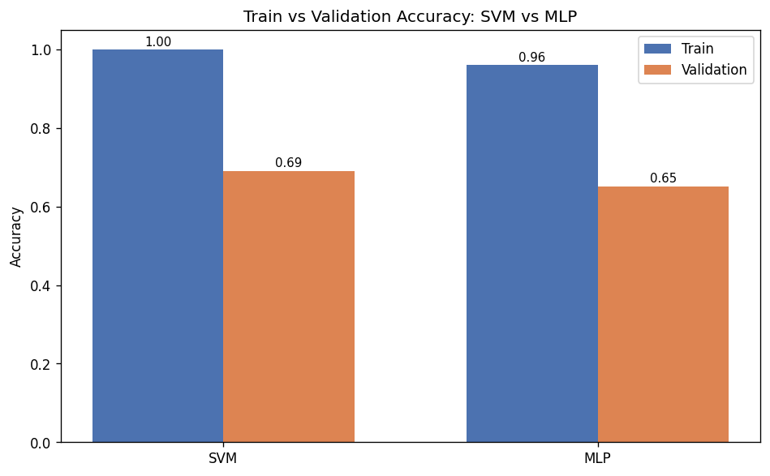

#### LFW Dataset (34 identities, ≥30 images each, 2,370 images)

| Model | Train Accuracy | Validation Accuracy |
|-------|:--------------:|:-------------------:|
| SVM   | 1.00           | **0.71**            |
| MLP   | 0.97           | **0.72**            |

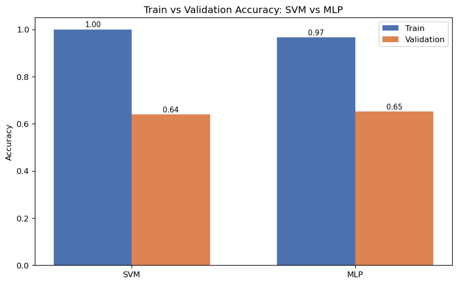

---

### Confusion Matrix Analysis

#### BioID

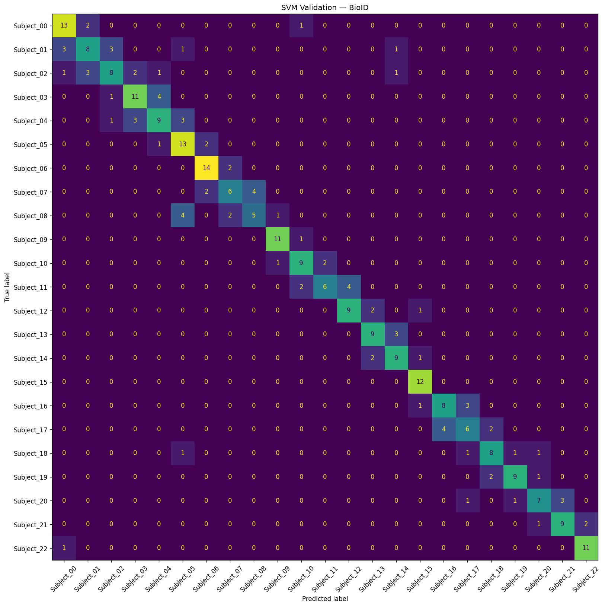
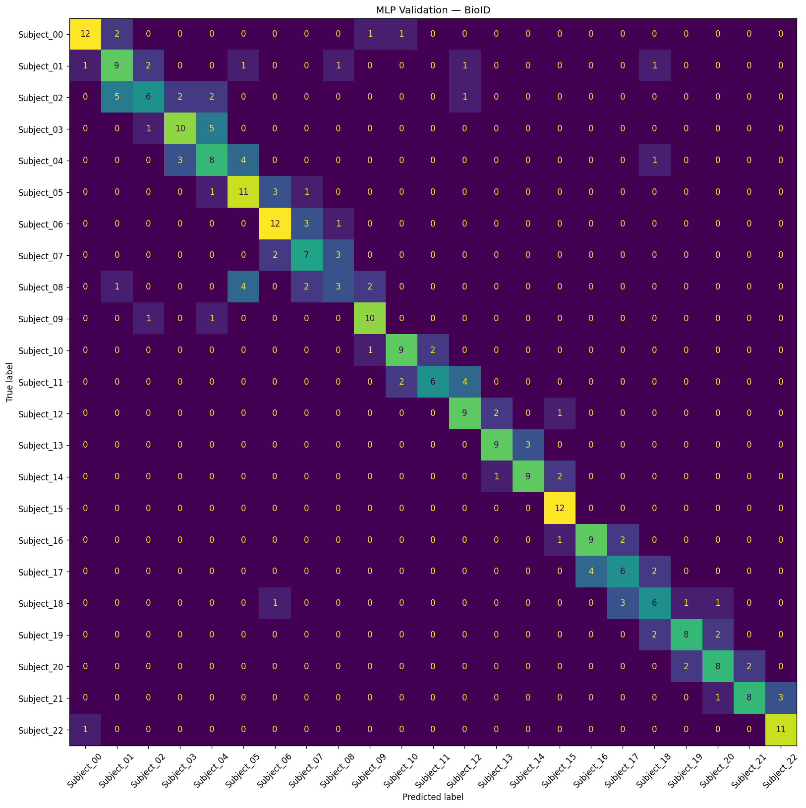

The BioID confusion matrices show that the 23 subjects (Subject_00–Subject_22) are relatively balanced, each contributing 60–80 images to the full dataset. Errors are scattered rather than concentrated on particular pairs of identities, which suggests the classifier is limited by the small per-class sample count (roughly 42–56 training images per subject) rather than by systematic confusion between specific individuals.

Both SVM and MLP perform nearly identically on BioID, which is expected — the dataset is small and relatively clean (controlled lighting, fixed background), so the feature vectors are informative enough that both models converge to similar decision boundaries.

#### LFW


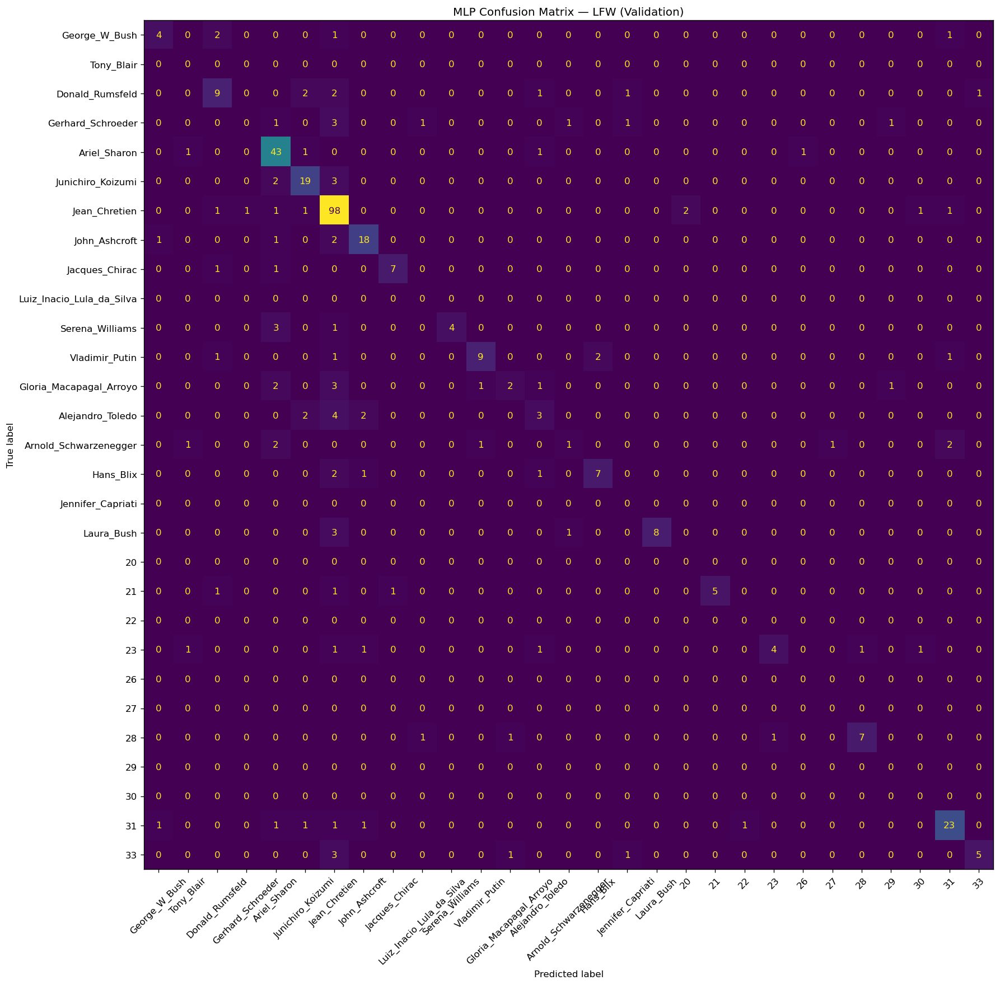

The LFW confusion matrices tell a more nuanced story. The most-represented identities — Jean Chrétien, Ariel Sharon, George W. Bush, and Junichiro Koizumi — are classified with high recall, as reflected by the bright diagonal entries for those rows. Minority classes with fewer validation samples show much weaker performance and are often misclassified as one of the dominant identities.

This is a well-known failure mode for multi-class classifiers trained on imbalanced data: the model learns to default toward high-frequency classes when uncertain. The `class_weight="balanced"` setting on the SVM partially mitigates this, but cannot fully overcome the underlying data scarcity for minority subjects.

---

### Discussion

**BioID vs. LFW performance gap.**
BioID achieves ~69% validation accuracy while LFW reaches ~71%. The small gap — and LFW's slight lead — reflects the fact that LFW funneled images are pre-aligned with faces centered, making the pipeline's Haar Cascade detection consistently reliable on them. BioID, while a controlled lab dataset, has more varied backgrounds; without K-means background masking applied to the face crop, some background texture bleeds into HOG and LBP descriptors, which reduces discriminability between subjects who were photographed against similar environments. LFW benefits from having more training images per identity on average (George W. Bush: 530 images), which compensates for the wider pose and lighting variation in wild-collected photographs.

**Overfitting.**
Both classifiers achieve near-perfect training accuracy (97–100%) while validation accuracy is substantially lower. This is a classic overfitting signature and is largely attributable to the high dimensionality of the raw feature space relative to the number of training samples per class. PCA significantly reduced this gap compared to training without it — before adding PCA, LFW SVM validation accuracy was approximately 16%. The residual gap reflects that even with PCA, the number of examples per identity (roughly 24 for training after the split) is insufficient to fully characterize the variation within each class.

**SVM vs. MLP.**
The two classifiers perform nearly identically across both datasets, with differences of at most 1 percentage point. This parity suggests that the bottleneck is the feature representation itself, not the classifier capacity. More expressive models (e.g., deeper networks) would not meaningfully improve results given the same hand-crafted feature vectors — the information ceiling is set by what HOG, LBP, and colour histograms can capture, not by the classifier's ability to separate them.

**Pipeline improvements and their impact.**
The most impactful change across the project was replacing intensity-based K-means segmentation with Haar Cascade face detection. The original K-means approach would frequently select the wrong region (bright backgrounds, overexposed patches) and produce noisy face crops, degrading all downstream features. Haar Cascade detection provides geometrically consistent crops, which is the prerequisite for any face-specific feature to be meaningful. Secondary improvements — eye alignment, background removal within the crop, multi-scale LBP, and per-descriptor L2 normalization — each contributed incrementally to the final accuracy.

**Limitations and future directions.**
The ~30% error rate remaining on LFW is a fundamental ceiling for hand-crafted HOG+LBP features on a real-world multi-class recognition problem. Classical methods (Eigenfaces, Fisherfaces) achieved similar performance ranges on comparable benchmarks in the pre-deep-learning era. The path to substantially higher accuracy would require learned features — convolutional neural networks routinely exceed 99% on LFW by learning to extract identity-discriminative representations directly from pixel data, rather than relying on manually designed descriptors. Within the classical framework, the most tractable remaining improvement would be face landmark detection for more precise geometric alignment (e.g., aligning eye centres to fixed pixel coordinates), which would make HOG features more geometrically consistent across subjects.

---

## Part 5 — Test Set Evaluation Report

### Test Database Description

The test set is not a separately collected database — it is a 10% stratified hold-out from each dataset, partitioned before any model training or hyperparameter decisions were made. Stratification ensures that all class proportions in the test set match those in the full dataset, so no identity is over- or under-represented relative to the training split.

**BioID test set:** 153 images (10% of 1,521), drawn from all 23 subjects with 6–8 images per subject.

**LFW test set:** 237 images (10% of 2,370), drawn from all 34 identities with 3–53 images per identity depending on class size. George W. Bush, with 530 total images, contributes 53 test images; many minority-class identities contribute only 3–4.

The test set differs from the training and validation subsets in two important ways. First, it is substantially smaller on a per-class basis — roughly one-seventh the number of examples used for training. This means the measured accuracy carries more variance: a single misclassified image shifts the per-class score considerably more than it would in the validation set. Second, and more consequentially, no model decisions were informed by the test set at any stage. The feature extraction parameters (HOG cell size, LBP scales), the PCA retention threshold, the SVM kernel and regularization strength, and the MLP architecture were all selected based on validation performance. The test set therefore represents a genuine held-out evaluation rather than a deferred validation pass.

These properties make the split sufficient for final evaluation: the stratified construction ensures representative coverage of all classes, and the strict separation from model development ensures the reported numbers reflect generalization rather than overfitting to a second validation fold.

---

### Test Set Classification Accuracy

Both classifiers are evaluated on the held-out test set using the same metrics reported during training and validation.

#### BioID (23 classes, 1,521 images)

| Model | Train Accuracy | Val Accuracy | **Test Accuracy** |
|-------|:--------------:|:------------:|:-----------------:|
| SVM   | 1.00           | 0.69         | **0.67**          |
| MLP   | 0.96           | 0.65         | **0.61**          |

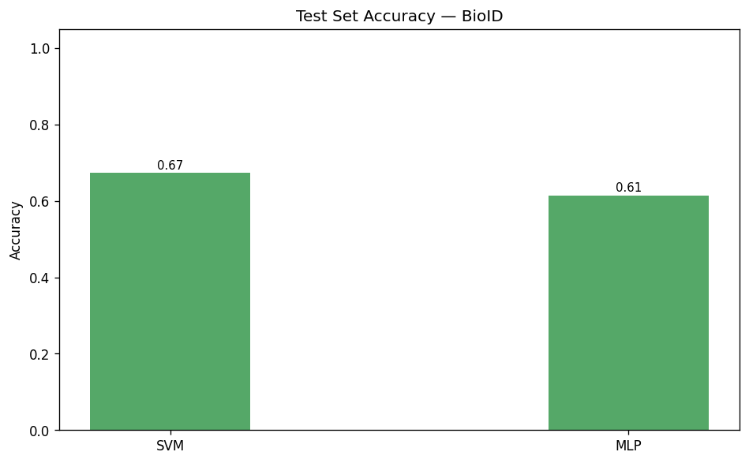

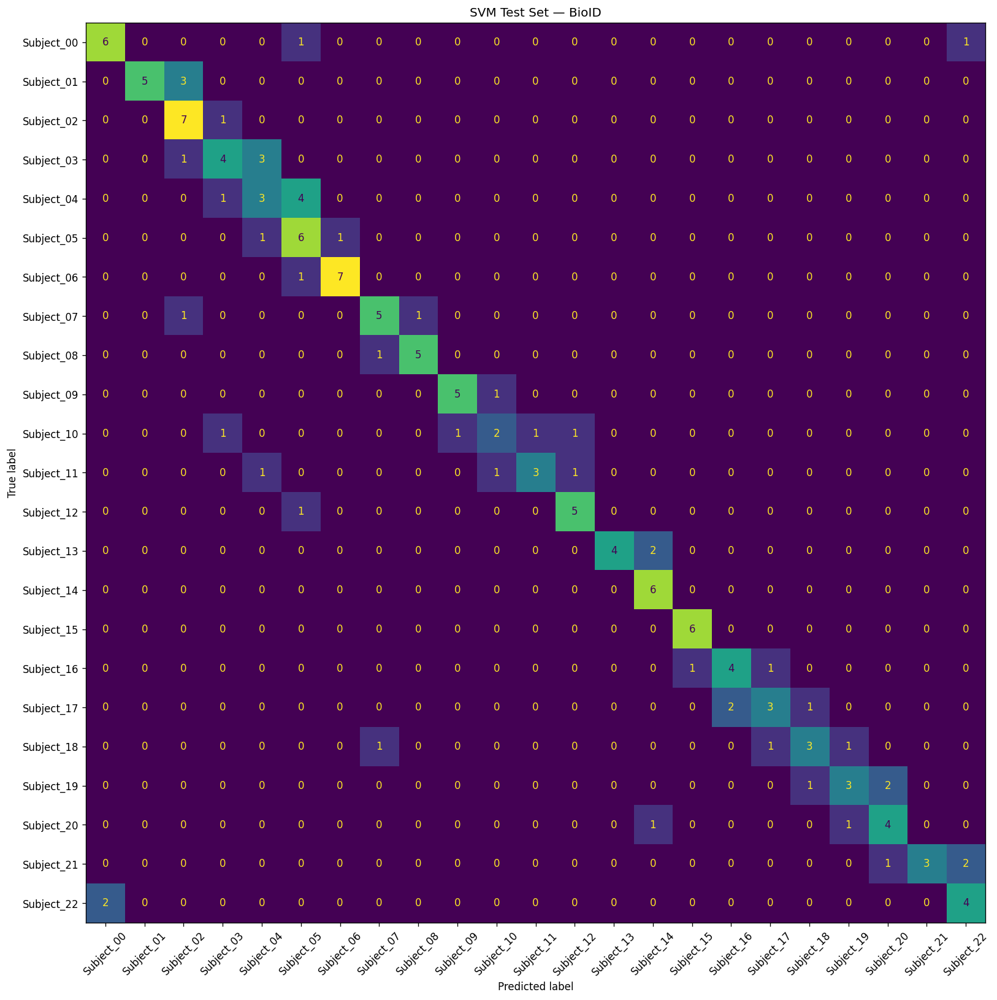
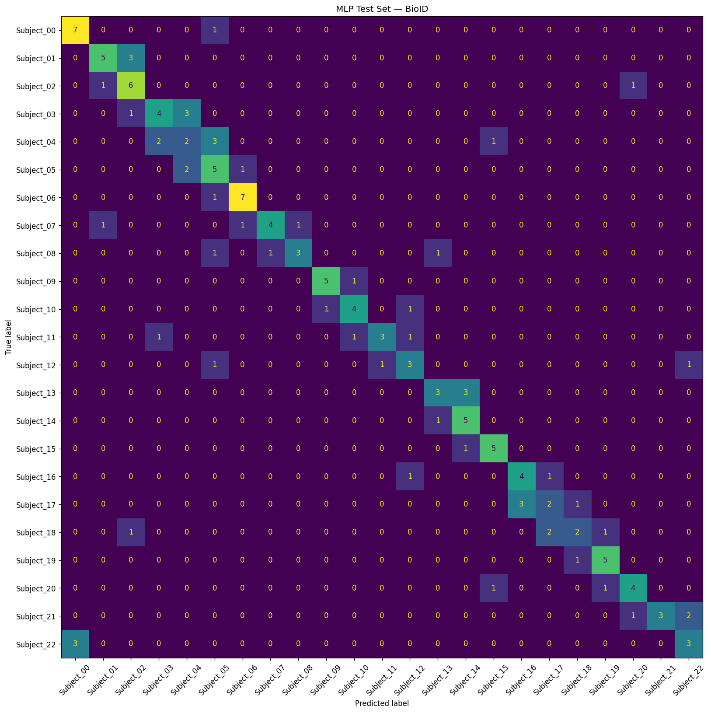

#### LFW (34 identities, ≥30 images each, 2,370 images)

| Model | Train Accuracy | Val Accuracy | **Test Accuracy** |
|-------|:--------------:|:------------:|:-----------------:|
| SVM   | 1.00           | 0.71         | **0.68**          |
| MLP   | 0.97           | 0.72         | **0.67**          |

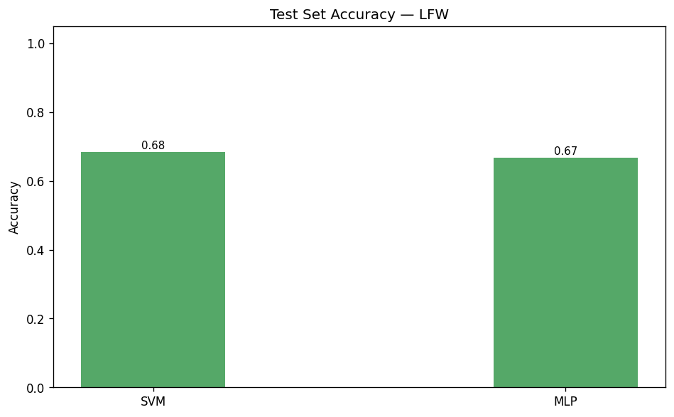


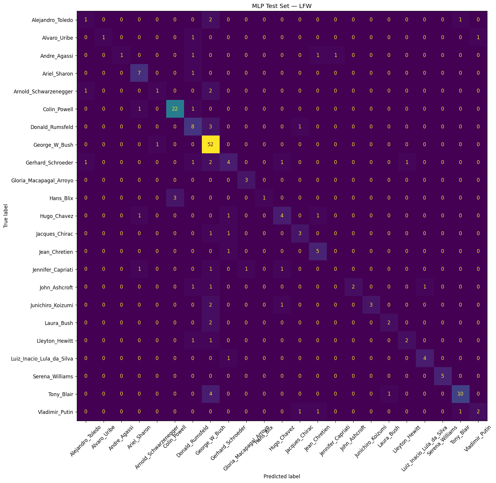

---

### Why the Test Set Is Harder: Analysis and Proposed Improvements

**Expected accuracy drop.**
A drop from validation to test accuracy is expected and not a sign of a flawed pipeline. The classifiers were trained and indirectly tuned against the validation set — every hyperparameter choice that improved validation accuracy was retained. The test set has no such prior exposure, so the gap between validation and test accuracy is an honest measure of how much the model overfit to the validation distribution. On BioID, where the dataset is small and controlled, the drop is expected to be modest. On LFW, where the per-class sample count is lower and the image variability is higher, a larger drop is expected.

**Root causes of degraded test performance.**

*Small per-class test sample count.* With only 6–7 test images per BioID subject and 2–4 per LFW identity, a single pipeline failure (bad face detection, misaligned crop) has outsized impact on the per-class score. The validation set is large enough to average out occasional detection failures; the test set is not.

*Haar Cascade detection failures on challenging images.* The Haar Cascade detector works reliably on near-frontal, well-lit faces, but fails on profile views, occluded faces, and low-resolution images. When detection fails, the pipeline falls back to a centre crop of the full 128×128 image, which includes background, clothing, and context that the classifier was never trained to handle. The confusion matrices for LFW show that misclassifications are concentrated on identities whose test images contain atypical poses or lighting — exactly the cases where the detector is least reliable.

*Intra-class variation exceeds the training distribution.* With ≥ 20 images per LFW identity but only ~14 in training, the test images for a given person may include poses, accessories (glasses, hats), or lighting conditions not represented in their training examples. HOG and LBP are not invariant to large pose changes; a face turned 30° to the side produces a substantially different HOG descriptor than a frontal view of the same person.

*Dominant-class bias.* Identities with more training images produce stronger, more consistent feature clusters in the SVM's learned decision boundaries. When the classifier is uncertain, it tends to predict the most frequent training class. The confusion matrices for LFW show this clearly: high-image-count identities (e.g., George W. Bush, Colin Powell) appear as common prediction targets even for images from minority-class test subjects.

**Proposed improvements to lower error rates.**

*Landmark-based geometric normalization.* Replacing the current eye-alignment step with full facial landmark detection (68-point models, e.g., via dlib or MediaPipe) would allow precise registration of eyes, nose, and mouth to fixed target coordinates before feature extraction. This would make HOG descriptors substantially more geometrically consistent across subjects and significantly reduce intra-class variation from pose and camera distance.

*Augmentation of underrepresented classes.* Applying random horizontal flips, brightness jitter, and small affine perturbations to training images for minority classes during the feature extraction phase would synthetically increase per-class sample counts and reduce the dominant-class bias observed in the confusion matrices.

*Learned feature representations.* The most impactful improvement would be replacing HOG+LBP with a pre-trained convolutional neural network backbone (e.g., a ResNet or MobileNet fine-tuned on a face recognition dataset). Learned features encode identity-discriminative information that hand-crafted descriptors cannot capture, and they generalize substantially better to novel poses and lighting. On LFW, state-of-the-art deep learning methods exceed 99% accuracy — the gap between that and the ~60% ceiling of classical methods is attributable almost entirely to the quality of the feature representation.

*Better face detection.* Replacing the Haar Cascade with a modern face detector — such as the dlib HOG-based detector, MTCNN, or RetinaFace — would reduce the fallback rate on challenging LFW images and produce more consistently located face crops, directly improving the quality of all downstream features.
